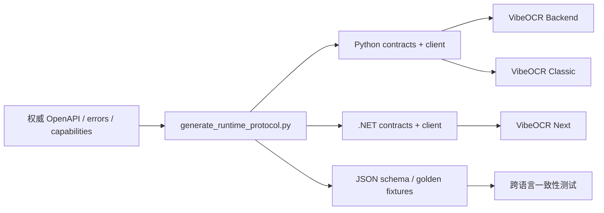

<div align="center">

# VibeOCR Protocol

**VibeOCR 前端与本地运行时之间的版本化契约、客户端与一致性测试**

[](https://github.com/FelixJI/vibeocr-protocol/actions/workflows/ci.yml)
[](https://github.com/FelixJI/vibeocr-protocol/releases/latest)
[](pyproject.toml)
[](global.json)
[](LICENSE)

[定位](#项目定位) · [产物](#交付内容) · [开发](#开发与验证) · [源码导读](docs/source-reading-guide.md) · [设计](docs/protocol-v2-design.md)

</div>

VibeOCR Protocol 是 VibeOCR 多仓协作的协议单一事实源。它维护 Protocol v2 的 OpenAPI、错误模型、
bootstrap/capabilities 约定，并从这些输入生成 Python 与 .NET 契约、HTTP 客户端、schema 和 golden fixtures。

> [!IMPORTANT]
> 这个仓库不是可运行的 OCR 服务，也不包含桌面 UI。VibeOCR Backend 实现运行时，Classic 与 Next
> 消费这里发布的客户端和契约。

## 项目定位



协议变更的目标不是“让某个客户端先工作”，而是让权威输入、生成物、两种语言的客户端和 golden
测试在同一提交中保持一致。

## 交付内容

| 交付物 | 消费者 | 用途 |
| --- | --- | --- |
| Python contracts/client wheel | Backend、Classic | 数据模型、运行时 HTTP 客户端 |
| .NET contracts/client NuGet | Next | typed contracts 与 HTTP 客户端 |
| OpenAPI 与 JSON schema | 所有组件 | 协议审阅、生成和验证 |
| golden fixtures | 跨语言测试 | 确认序列化、错误与状态语义一致 |
| build identity / SBOM | 发布流水线 | 版本、来源与资产绑定 |

正式资产及精确文件名以 [`.ci/project.json`](.ci/project.json) 的发布契约为准。

## 快速开始

### 只想理解协议

依次阅读：

1. [`docs/protocol-v2-design.md`](docs/protocol-v2-design.md)
2. [`docs/source-reading-guide.md`](docs/source-reading-guide.md)
3. `packages/vibeocr-contracts-py/src/vibeocr/runtime_contracts/openapi.yaml`
4. 对应的 Python/.NET 客户端与 golden tests

### 准备开发环境

需要 [uv](https://docs.astral.sh/uv/)、仓库锁定的 Python 与 [.NET SDK](global.json)：

```powershell
git clone https://github.com/FelixJI/vibeocr-protocol.git
cd vibeocr-protocol
uv sync --frozen --group dev
pwsh -NoProfile -File scripts/check-quality.ps1
```

## 仓库地图

```text
packages/
├── vibeocr-contracts-py/    # Python contracts 与权威协议输入
└── vibeocr-runtime-client-py/ # Python HTTP client
src/dotnet/
├── VibeOCR.Contracts/       # .NET contracts
└── VibeOCR.Runtime.Client/  # .NET HTTP client
scripts/
├── generate_runtime_protocol.py # 协议生成器
├── check-quality.ps1        # 本地质量入口
└── automation.py            # CI/发布稳定入口
tests/                       # Python schema、golden 与客户端测试
dotnet-tests/                # .NET contracts/client tests
docs/                        # 设计与源码阅读文档
.ci/project.json             # 质量、构建与发布契约
```

目录名称以仓库当前内容为准；寻找入口时优先使用 `rg --files`，不要假设生成包的内部布局。

## 协议变更流程

1. 修改权威 OpenAPI、错误或 capability 输入。
2. 运行生成器更新全部派生文件。
3. 检查生成 diff，不手工修补生成物。
4. 更新 Python 与 .NET 的 golden/behavior tests。
5. 运行完整质量入口，确认生成一致性与跨语言契约。

生成命令：

```powershell
uv run python scripts/generate_runtime_protocol.py
pwsh -NoProfile -File scripts/check-quality.ps1
```

生成器会更新多个包与 fixture。提交前应确认 diff 只包含预期协议变化。

## 开发与验证

```powershell
uv sync --frozen --group dev
pwsh -NoProfile -File scripts/check-quality.ps1
dotnet test tests/dotnet/VibeOCR.Contracts.Tests/VibeOCR.Contracts.Tests.csproj -c Release
dotnet test tests/dotnet/VibeOCR.Runtime.Client.Tests/VibeOCR.Runtime.Client.Tests.csproj -c Release
```

精确 solution/project 参数与 CI 顺序以 [`.ci/project.json`](.ci/project.json) 为准。PR 上的
`required` check 会执行生成一致性、Python/.NET 测试、构建与发布 smoke。

## 兼容性原则

- capability 决定功能协商，客户端不应根据组件版本号猜测行为。
- 未知字段应按协议设计处理，不能依赖某种语言的偶然序列化行为。
- 错误码、状态转换和取消语义是跨组件 API，不是实现细节。
- Backend Release 会绑定精确 Protocol 输入；本地开发不得使用路径依赖替代正式组件边界。

## 参与贡献

提交前请阅读 [`CONTRIBUTING.md`](CONTRIBUTING.md)、[`docs/protocol-v2-design.md`](docs/protocol-v2-design.md)
与 [源码阅读指南](docs/source-reading-guide.md)。使用 Conventional Commit，并为协议行为变化补充两种语言的
相应测试。

## 许可证

本项目基于 [LICENSE](LICENSE) 中的条款发布。
