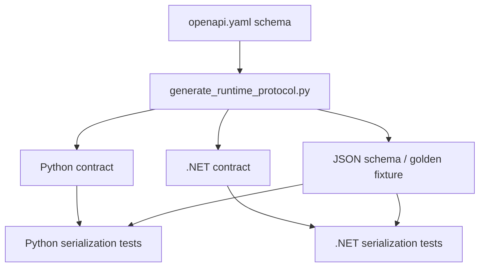

# VibeOCR Protocol 源码阅读指南

本指南帮助初学者理解“协议事实源如何变成两种语言都能使用的客户端”。第一次阅读不需要掌握全部
OpenAPI 或生成器实现，只需沿一条字段从输入追到测试。

## 心智模型

把仓库分成四层：

1. **权威输入**：OpenAPI、错误定义、bootstrap 与 capabilities。
2. **生成器**：读取权威输入，产出各语言 contracts/client 与 schema/fixtures。
3. **手写运行时代码**：HTTP、轮询、错误映射等不能只靠 schema 表达的行为。
4. **一致性测试**：用 golden 数据确认 Python 与 .NET 对同一 payload 得到相同理解。

协议仓库最重要的规则是：派生文件不应成为新的事实源。

## 15 分钟阅读路线

1. 读 `docs/protocol-v2-design.md`，先理解 job、observe、command、capabilities 等领域概念。
2. 读 `packages/vibeocr-contracts-py/src/vibeocr/runtime_contracts/openapi.yaml` 的 paths 与 schemas。
3. 在 `scripts/generate_runtime_protocol.py` 中搜索一个 schema 名称，观察它如何进入生成流程。
4. 在 Python 与 .NET contracts 包中搜索同名类型。
5. 在 tests 与 dotnet tests 中搜索同一字段或 fixture。

## 第一条纵向链：一个 schema 如何跨语言落地

任选一个较小的请求或响应类型，按以下顺序阅读：



阅读时关注：

- required/optional/default 在两种语言里是否表达一致；
- JSON 字段名与语言属性名如何映射；
- enum、联合类型和未知字段如何处理；
- 错误 payload 是否保留稳定的 machine-readable code；
- golden fixture 是否覆盖成功与失败两种方向。

## 第二条纵向链：RuntimeHttpClient

生成 contracts 之后，选择 Python 或 .NET 的 `RuntimeHttpClient`：

1. 从公开方法看客户端暴露的最小接口。
2. 追踪 URL、header、timeout 与请求体如何构造。
3. 查看非 2xx 响应如何转换为协议错误。
4. 查看 job observe/command 的状态与取消语义。
5. 对照 mock HTTP 或 golden tests，确认边界情况。

读完一种语言后，再对照另一种语言的同名行为；目标是语义一致，不要求内部实现逐行对称。

## capability 为什么比版本判断重要

前端应读取运行时 ready/bootstrap 返回的 capabilities 决定可用功能。版本号适合诊断和资产绑定，
不适合替代功能协商。阅读 capability 相关代码时，重点确认：

- capability 在权威输入中如何声明；
- 两种语言是否生成相同名称和类型；
- 缺少 capability 时客户端怎样 fail closed 或降级；
- Backend 与前端的测试是否使用真实协议名称。

## 什么时候应该改哪个位置

| 需求 | 起点 | 还需要同步检查 |
| --- | --- | --- |
| 新增请求字段 | OpenAPI/schema 输入 | 两种语言生成物、golden、兼容性 |
| 新增错误码 | 权威 error 定义 | 客户端映射、文档、失败测试 |
| 新增能力协商 | capability/bootstrap 输入 | Backend 暴露、前端消费、fixtures |
| 调整 HTTP 行为 | 对应 client 手写层 | Python/.NET 行为测试 |
| 修改包或资产 | `.ci/project.json`、自动化脚本 | build identity、SBOM、release smoke |

## 生成物边界

修改前先看文件头、生成脚本和 `git grep`：

- 若文件由 `generate_runtime_protocol.py` 生成，回到权威输入修改；
- 运行生成器后审查全部 diff；
- 不为让一致性检查通过而只修一个语言的生成结果；
- 不把本地绝对路径、editable dependency 或邻仓源码写入包配置。

## 最小验证到完整门禁

首次小改可以从相关测试开始，提交前运行仓库入口：

```powershell
uv sync --frozen --group dev
uv run python scripts/generate_runtime_protocol.py
pwsh -NoProfile -File scripts/check-quality.ps1
```

如果改动 .NET 客户端或 contracts，再运行 `.ci/project.json` 指定的 Release 测试项目。完整 PR CI 还会
验证构建、资产集合与 release smoke。

## 常见误区

- **把这个仓库当作 OCR 服务**：它只定义与交付协议，不执行推理。
- **直接修改生成物**：下一次生成会覆盖，且两种语言可能失去一致性。
- **只跑一种语言的测试**：协议变化必须考虑全部消费者。
- **用版本号猜 capability**：功能协商应读取 capability。
- **只验证正常 payload**：错误、取消、未知字段和状态转换才是兼容性高风险区。
- **把邻仓作为 editable dependency**：正式 Release 绑定的是已发布组件和可验证资产。

## 读完后的自检

你应该能回答：

- 哪些文件是协议权威输入，哪些是生成物？
- 一个字段如何进入 Python、.NET 和 golden tests？
- `RuntimeHttpClient` 的手写行为在哪里测试？
- capability 与组件版本分别解决什么问题？
- 修改协议后，为什么必须审查跨语言 diff？

回答这些问题后，再从一个小 schema 或错误码开始第一个 PR，会比直接修改大段生成器更稳妥。
